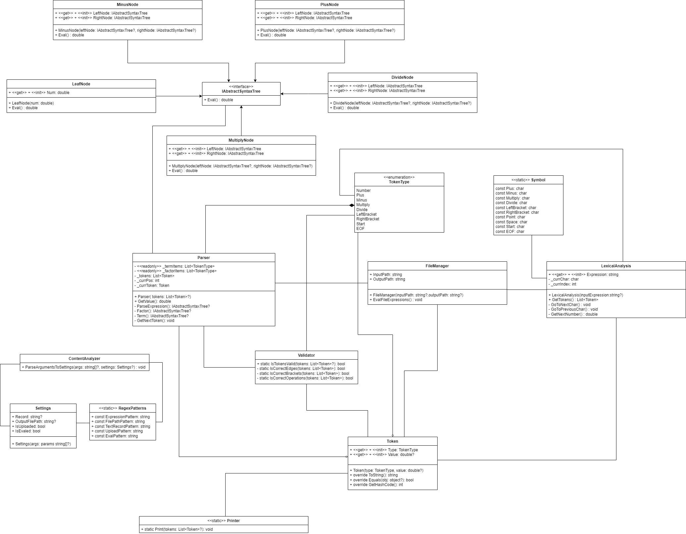

<!-- ABOUT THE PROJECT -->

## About The Project


  <br><br>

I present my own implementation of a string and file calculator. The program accepts as input an expression to be calculated or a path to a file that also contains a set of expressions and a flag indicating the startup mode. The implementation of my solution is based on building an AST and recursively traversing each node. Below, I'll tell you more about the launch methods and modes of operation.

<!-- GETTING STARTED -->

<br><br>

## Installation

_Follow these steps to get the program set up and running correctly._
<br>

1. Clone the repo

```sh

git clone https://git.foxminded.ua/foxstudent105510/task-4-calculator.git

```

2. Go to the catalog with the main project

```sh

cd task-4-calculator/Calculator

```

3. Compile and run the project

```sh

dotnet run "<expression>" -e

```

<!-- USAGE EXAMPLES -->

<br><br>

## Usage

_General project syntax:_

```sh

1. dotnet run "<expression>" -e

2. dotnet run  -e "<expression>"

3. dotnet run "<path>" -u

4. dotnet run -u "<path>"

```

<br>

**-e** - mode of calculating an arithmetic expression

**-u** - mode of loading a file with a set of arithmetic expressions

**<expression\>** - expression to be calculated

**<path\>** - the path to the file containing the set of expressions

<br><br>

### Examples:

```

dotnet run "2+2*2" -e

```

```

dotnet run  -e "(2+2)*2"

```

```

dotnet run "./input_file.txt" -u

```

```

dotnet run -u "D:/testing/input-data/input_file.txt"

```

<!-- ROADMAP -->

<br><br>

## Roadmap

-   [x] Representation of tokens and their types

-   [x] Converting an input expression to a set of tokens

-   [x] Creating classes for building ASTs

-   [x] Parsing tokens, traversing AST, and evaluating an expression

-   [x] Creating a validator for data

-   [x] Creating a class to display the required data

-   [x] Ability to evaluate expressions from a file

-   [x] Create regular expressions for data processing

-   [x] Creating a class for different startup configurations

-   [x] Creating unit tests

-   [x] Create a UML diagram for the entire solution
